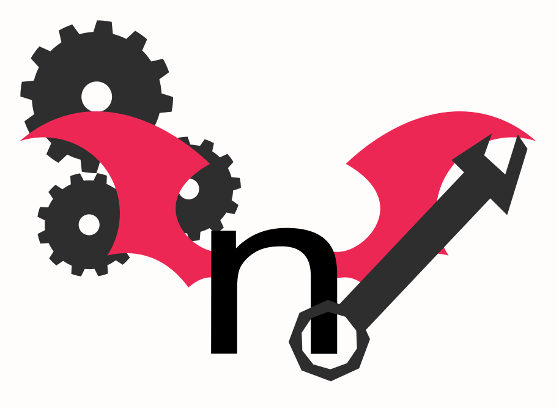

<div align="center">
  
  <h1>nhentai tools</h1>
  <p>Unofficial Python library for interacting with nhentai.net without API key.</p>

  <!-- Badges -->

[](https://pypi.org/project/nhentai_tools/)
[](LICENSE.md)

</div>

## Requirements

```bash
requests >= 2.34.2
beautifulsoup4 >= 4.15.0
```

## Installation

```bash
pip install nhentai_tools
```

**nhentai tools requires python >= 3.9**

## Basic Usage

### Import module

```python
# Import module before calling functions
import nhentai_tools
```

### Download gallery by ID

```python
# Download gallery in gallery folder and embed metadata
nhentai_tools.download(1337, path="gallery", metadata=True)
# Downloaded files can be found in gallery/
```

### Mass download by tag, character, artist or parody

```python
# Download all galleries from artist and embed metadata
nhentai_tools.artist_download("coolsigma", True)
# Downloaded files can be found in coolsigma/

# Download all galeries with specified character and embed metadata
nhentai_tools.character_download("JetStream-Sam", True)
# Downloaded files can be found in JetStream-Sam/
```

A library has more mass download functions, please refer to [wiki](https://github.com/minimalcorruption/nhentai_tools/wiki/Documentation)

### Working with metadata

```python
# Extract metadata, return it as list and save "var1" variable
var1 = nhentai_tools.extract_metadata(1337)

# Write metadata in metadata.txt file
nhentai_tools.embed_metadata(var1, path="sixseven")
# File can be found in sixseven/metadata.txt
```

## Documentation

Full documentation can be found on [wiki](https://github.com/minimalcorruption/nhentai_tools/wiki/Documentation)

## Building

```bash
# Required for building
pip install twine
pip install build

git clone https://github.com/minimalcorruption/nhentai_tools
cd nhentai_tools
python -m build

# Installing from local build
pip install .
```

## Important

**_This project in beta, bugs are expected_<br>**
**_If something goes wrong, please open an issue_**

## AI Notice

**_Some comments and docstrings has been written by an AI<br>_**
**_Wkik has been written by an AI based on docstrings and comments<br>_**

**I will get rid of AI-generated contenet in next releases**
